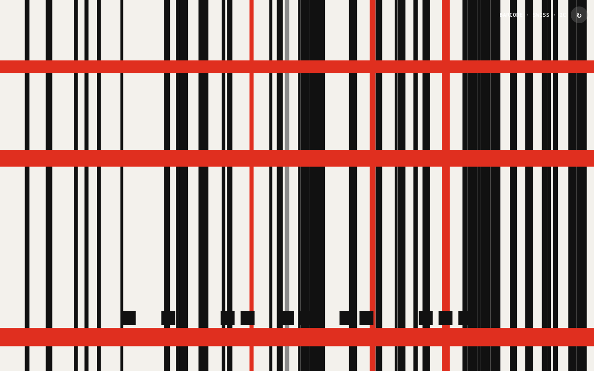
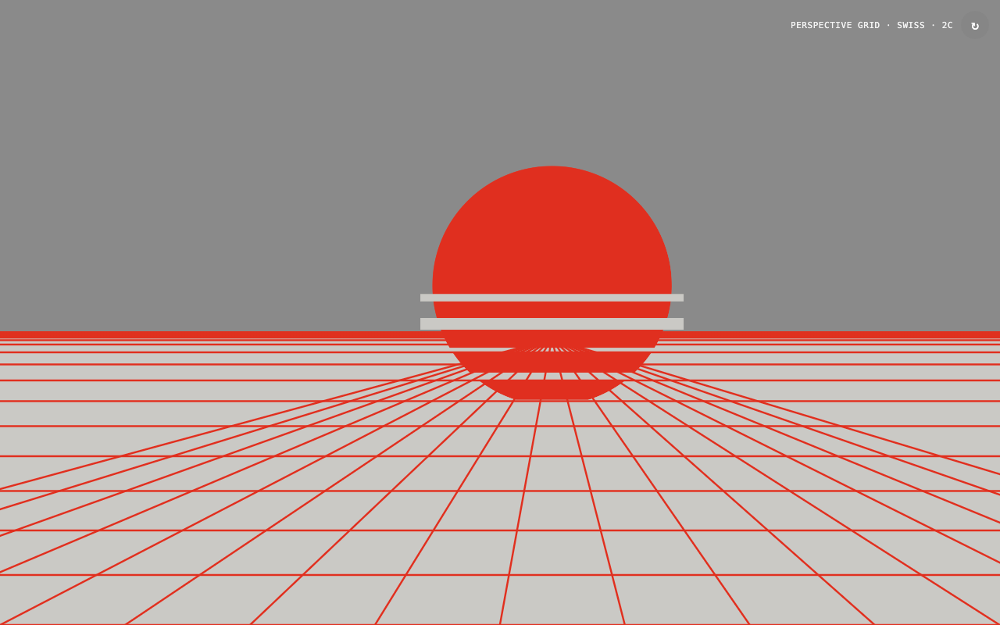
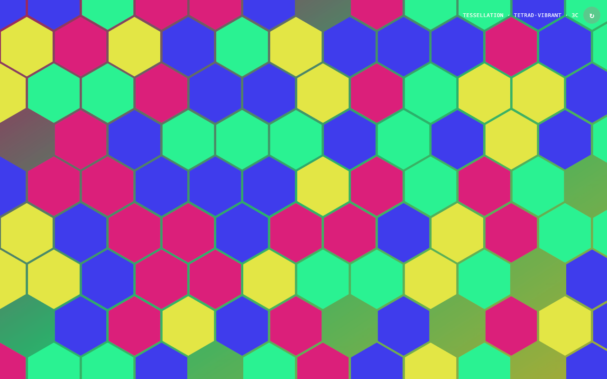
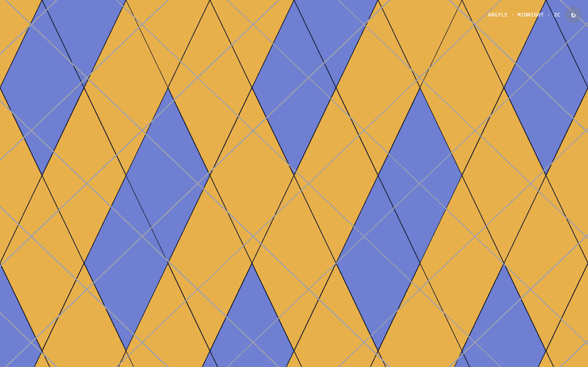
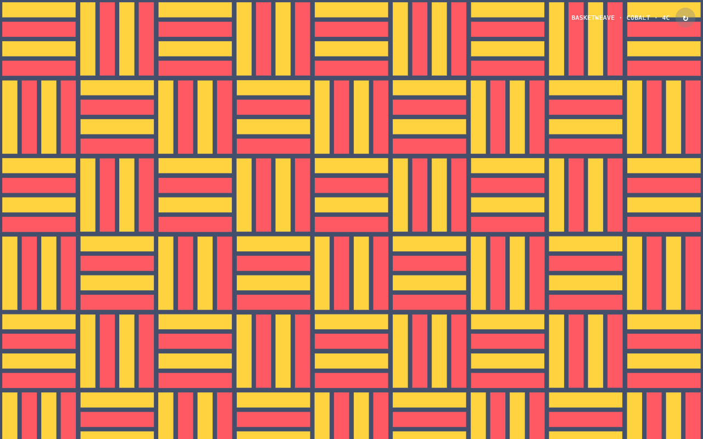
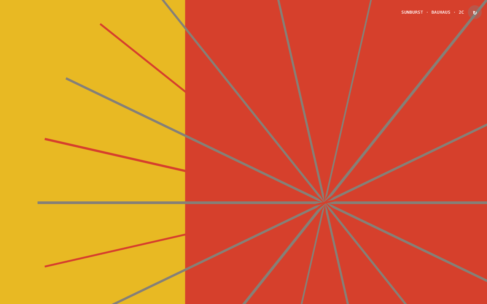
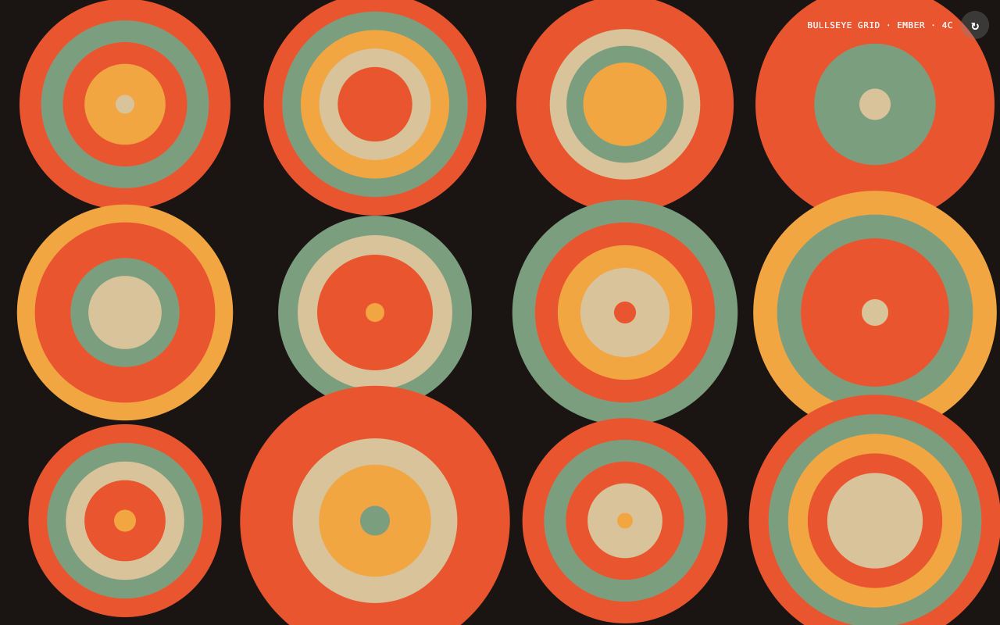
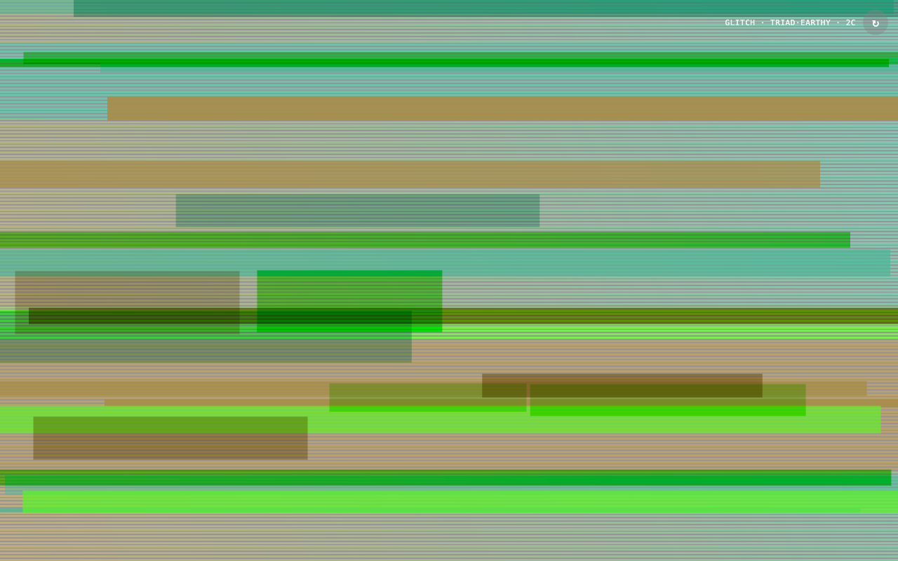

# Design New Tab Page

A random design new tab page replacement for Google Chrome.

[Live](https://greggman.github.io/design-new-tab-page/)

You can install it [from the chrome store](https://chrome.google.com/webstore/detail/design-new-tab-page/bjeoojailkkeekndkklegeiimdbkjock)
or see below how to install manually.

## Process to manually install in Google Chrome as extension: 

* Open Terminal/Command Prompt
* `git clone https://github.com/greggman/design-new-tab-page.git`
   OR [download the zip](https://github.com/greggman/design-new-tab-page/archive/refs/heads/main.zip) and unzip it.
* Copy this link  `chrome://extensions/` and paste in Chrome
* Enable Developer Mode and click `Load unpacked extension` button and select the extension folder.

## License: [MIT](LICENSE.md)
